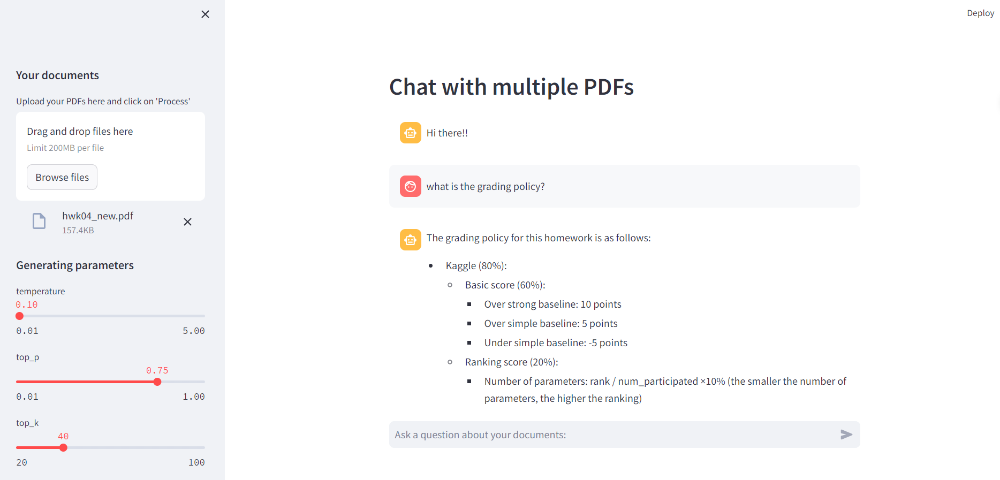

# Chat-PDF

The backend of the project is heavily based on [https://github.com/pplonski/my_ml_service](https://github.com/pplonski/my_ml_service).

In this project, we provided a simple veresion of chat with pdf AI assistant, which can do conversation with your uploaded pdfs. We use langchain with hf llama2 to build the application with django as backend and streamlit as frontend.

## Usage

To chat with your own pdfs, you have to

1. clone the project
2. create a .env file in backend/server/server with

```env
HF_API_TOKEN = xxx
SECRET_KEY = xxx
```

which

- `HF_API_TOKEN:` your huggingface api token (this is make sure you can run llama2 in your local machine)
- `SECRET_KEY:` your django secret key

